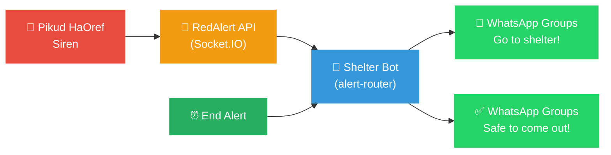
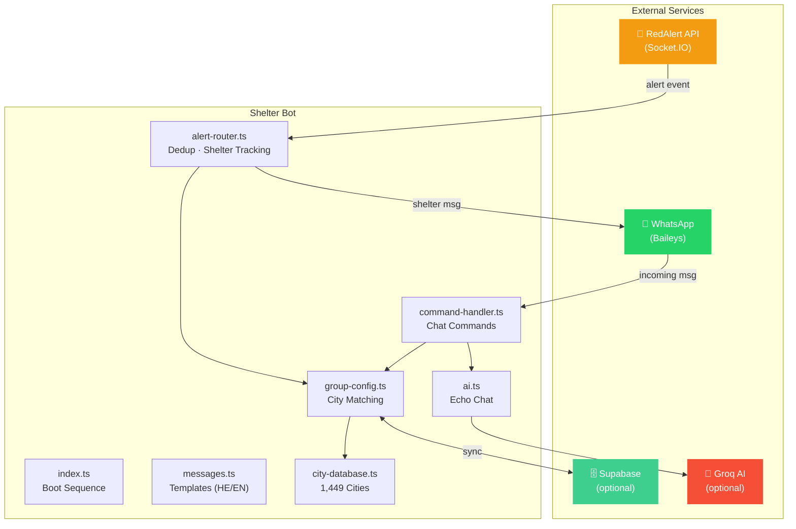

<div align="center">

# 🚨 RedAlert Shelter Bot

### Real-time WhatsApp shelter notifications for Israel

[](LICENSE)
[](https://nodejs.org)
[](https://www.typescriptlang.org)
[](https://www.whatsapp.com)

**When Pikud HaOref fires a siren → groups get "go to shelter"**
**When it's over → "safe to come out"**

[Quick Start](#-quick-start) · [Commands](#-commands) · [Features](#-features) · [Deploy](#-deployment)

</div>

---

## ⚡ How It Works



## ✨ Features

<table>
<tr>
<td width="33%" valign="top">

### 🚨 Real-time Alerts
- Socket.IO websocket to RedAlert API
- 1,449 cities from Pikud HaOref
- Hebrew & English messages
- Smart deduplication
- Message queue during disconnections
- Shelter duration wrap-up

</td>
<td width="33%" valign="top">

### 🤖 AI Chat (Echo)
- `!ask` — ask the bot anything
- "אקו" / "echo" keyword triggers
- @mention or reply to bot
- DM the bot directly
- Group conversation memory
- Powered by Groq (Llama 3.3 70B)

</td>
<td width="33%" valign="top">

### 🎮 Engagement
- **Shelter activities** — 26 mini-challenges during alerts
- Per-group toggles

</td>
</tr>
</table>

## 🚀 Quick Start

### Option A: Zero Config (just try it)

```bash
git clone https://github.com/asaf5767/redalert-shelter-bot.git
cd redalert-shelter-bot
npm install
npm run setup     # press Enter to skip everything
npm run dev       # test mode — simulated alerts, no API keys needed
```

> Scan the QR code with WhatsApp → bot is running. **That's it.**

### Option B: Full Production Setup

```bash
git clone https://github.com/asaf5767/redalert-shelter-bot.git
cd redalert-shelter-bot
npm install
npm run setup     # interactive wizard walks you through everything
npm run dev       # or: npm run build && npm start
```

The setup wizard will:

| Step | What | Required? |
|------|------|-----------|
| 1️⃣ | **Supabase** — database for session persistence | Recommended |
| 2️⃣ | **RedAlert** — test mode or production API key | Test mode is free |
| 3️⃣ | **Groq AI** — enables Echo AI chat | Optional |
| 4️⃣ | **Admin** — restrict commands to phone numbers | Optional |

<details>
<summary><b>Manual setup</b> (without wizard)</summary>

```bash
cp .env.example .env
# Edit .env with your values
npm run dev
```

For the database, run [`setup/schema.sql`](setup/schema.sql) in your [Supabase SQL Editor](https://supabase.com/dashboard).

</details>

## 📋 Commands

<table>
<tr>
<td valign="top">

### Alert Management

| Command | Description |
|---------|-------------|
| `!addcity` תל אביב, חיפה | Add cities to monitor |
| `!removecity` חיפה | Remove cities |
| `!cities` | List monitored cities |
| `!clearalerts` | Stop all monitoring |
| `!search` ראש | Search 1,449 city names |
| `!lang` he/en | Change language |

</td>
<td valign="top">

### Info & Testing

| Command | Description |
|---------|-------------|
| `!status` | Show bot status |
| `!test` | Send test alert |
| `!help` | Show all commands |
| `!activities` on/off | Shelter challenges |

</td>
</tr>
</table>

### 🤖 AI Chat (Echo)

> Requires `GROQ_API_KEY` — get one free at [console.groq.com](https://console.groq.com)

| Trigger | How | Example |
|---------|-----|---------|
| `!ask` or `!ai` | Command | `!ask כמה זמן בממ"ד?` |
| אקו / echo | Keyword anywhere | `אקו מה קורה?` |
| @mention | Tag the bot | `@RedAlert מה המצב?` |
| Reply | Reply to bot message | *(just type)* |
| DM | Private chat | *(no command needed)* |

## 🔧 Configuration

<details>
<summary><b>All environment variables</b></summary>

| Variable | Required | Description |
|----------|----------|-------------|
| `SUPABASE_URL` | Recommended | Supabase project URL |
| `SUPABASE_KEY` | Recommended | Supabase anon/public key |
| `REDALERT_API_KEY` | For production | From [redalert.orielhaim.com](https://redalert.orielhaim.com) |
| `REDALERT_TEST_MODE` | — | `true` for simulated alerts (no key needed) |
| `GROQ_API_KEY` | For AI | Free from [console.groq.com](https://console.groq.com) |
| `ADMIN_NUMBERS` | Optional | Comma-separated phone numbers |
| `BOT_PHONE_NUMBER` | Optional | Bot's phone number |
| `LOG_LEVEL` | Optional | `debug` / `info` / `warn` / `error` |
| `INITIAL_GROUPS` | Optional | JSON array of pre-configured groups |

**Test mode extras** (when `REDALERT_TEST_MODE=true`):

| Variable | Default | Description |
|----------|---------|-------------|
| `REDALERT_TEST_TIMING` | `5s` | Alert frequency |
| `REDALERT_TEST_CITIES` | *(all)* | Cities to simulate |
| `REDALERT_TEST_ALERTS` | `missiles` | Alert types |

</details>

## 🏗️ Architecture



<details>
<summary><b>File structure</b></summary>

```
src/
├── index.ts                # Entry point — boot sequence
├── config.ts               # Environment variable loading + validation
├── types.ts                # TypeScript type definitions
├── services/
│   ├── whatsapp.ts         # Baileys connection, QR, reconnection, message queue
│   ├── redalert.ts         # Socket.IO connection to RedAlert API
│   ├── supabase.ts         # Database operations (optional)
│   └── ai.ts               # Groq AI integration
├── core/
│   ├── alert-router.ts     # Routes alerts → groups, dedup, shelter tracking
│   ├── group-config.ts     # Per-group city config (in-memory + DB sync)
│   ├── command-handler.ts  # Chat command processing
│   └── city-database.ts    # 1,449 cities from Pikud HaOref
├── utils/
│   ├── logger.ts           # Pino structured logging
│   └── messages.ts         # All message templates (Hebrew + English)
└── data/
    └── cities.json         # City database (generated from cities_raw.json)

setup/
├── setup.js                # Interactive setup wizard
└── schema.sql              # Complete database schema
```

</details>

## 🚢 Deployment

<table>
<tr>
<td width="33%" valign="top">

### Railway
*(recommended)*

1. Push to GitHub
2. Connect in [Railway](https://railway.app)
3. Add env vars in dashboard
4. Auto-deploys on push ✨

</td>
<td width="33%" valign="top">

### Docker

```bash
docker build -t redalert-bot .
docker run -d \
  --env-file .env \
  redalert-bot
```

</td>
<td width="33%" valign="top">

### PM2

```bash
npm run build
pm2 start ecosystem.config.js
pm2 save && pm2 startup
```

</td>
</tr>
</table>

> ⚠️ **Only one instance can run at a time** — WhatsApp allows a single Baileys connection per phone number.

## 🗄️ Database

<details>
<summary><b>Schema (4 tables)</b></summary>

| Table | Purpose |
|-------|---------|
| `whatsapp_auth_state` | WhatsApp session/encryption keys |
| `group_city_config` | Per-group city lists, language, settings |
| `alert_log` | History of all alerts sent |
| `whatsapp_messages` | Message history for AI context |

See [`setup/schema.sql`](setup/schema.sql) for the complete schema.

</details>

## 🙏 Credits

| | |
|---|---|
| **RedAlert API** | [redalert.orielhaim.com](https://redalert.orielhaim.com) by Oriel Haim |
| **City database** | [eladnava/pikud-haoref-api](https://github.com/eladnava/pikud-haoref-api) |
| **WhatsApp** | [WhiskeySockets/Baileys](https://github.com/WhiskeySockets/Baileys) |
| **AI** | [Groq](https://groq.com) — Llama 3.3 70B |

---

<div align="center">

Made with ❤️ for keeping people safe

[MIT License](LICENSE)

</div>
